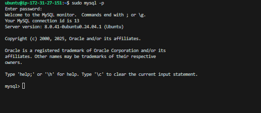

WEB STACK IMPLEMENTATION (LAMP STACK) IN AWS

### Introduction:

__The LAMP stack is a popular group of open-source software that consists of four main components: Linux, Apache, MySQL, and PHP (or sometimes Perl or Python). It is typically installed together in order to enable a server to host dynamic websites and web apps written in PHP. 
This term is an acronym which represents the Linux operating system with the Apache web server.
The site data is stored in a MySQL database, and dynamic content is processed by PHP. This documentation outlines the setup, configuration, and usage of the LAMP stack.__


---

### Linux
---
Linux is the foundational layer of the LAMP stack, providing the operating system on which all the other components run. As an open-source, Unix-like operating system, 
Linux offers a highly customizable and secure platform that powers most of the world's servers. 
Its compatibility with other open-source software and widespread community support make it the preferred choice for web hosting environments.
Popular Linux distributions used in LAMP stacks include Ubuntu, CentOS, and Debian.

### Apache
---
Apache is the web server software that handles serving web pages to users. 
It processes HTTP requests from client browsers and delivers content such as HTML pages, images, and scripts. 
Apache also supports advanced features including virtual hosting, secure connections (SSL/TLS), and URL rewriting.
Key Features of Apache:
Modular Design: Apache allows administrators to enable or disable different modules, such as SSL for encryption or mod_rewrite for URL manipulation.
Virtual Hosting: Apache can host multiple websites on a single server, each with its own domain name and directory.
SSL/TLS Support: Apache can secure connections between the server and clients using SSL (Secure Sockets Layer) and TLS (Transport Layer Security).
Cross-Platform: Although it runs best on Linux, Apache is also compatible with other operating systems like Windows and macOS.

### MySQL (or MariaDB)
---
MySQL is a relational database management system (RDBMS) used for storing and managing structured data in web applications. 
Its client-server architecture supports multiple clients performing operations such as data retrieval, manipulation, and deletion. 
MariaDB, a fork of MySQL, provides additional features and performance enhancements while maintaining compatibility with MySQL.

### PHP (or Perl/Python)

PHP is a server-side scripting language designed to create dynamic web content. 
Embedded within HTML code, PHP executes on the web server to generate content dynamically before sending it to the client. 
It interacts with databases, processes forms, and performs various tasks necessary for developing interactive web applications. 
Alternative scripting languages like Perl and Python can also be used in place of PHP, depending on the specific needs of the application.

---

### Use Cases for LAMP Stack
---
Content Management Systems (CMS): Platforms like WordPress, Drupal, and Joomla run on the LAMP stack.
E-commerce Websites: Many online stores use the LAMP stack to manage dynamic content, handle payments, and process user data.
Web Applications: From social networking sites to business applications, the LAMP stack provides the necessary infrastructure to support complex web-based platforms.
Custom Web Development: Developers can use the LAMP stack for custom web applications that require robust back-end support with PHP and MySQL, such as blogs, forums, or project management tools.


## Step 0: Prerequisites

__1.__ Launched an Ubuntu EC2 Instance named “Lamp_Stack_Server” with AMI of 24.04 LTS (HVM) in the us-west-2 region using the AWS console.


__2.__ Gave it the instance type of t2.micro which is within the free-tier. Created SSH key pair named __lamp_stack__ to access the instance on port 22.  The default VPC and Subnet were used for the networking configuration.


__3.__ The security group was configured with the following inbound rules:

- Allow traffic on port 22 (SSH) with source from any IP address. This is opened by default.
- Allow traffic on port 443 (HTTPS) with source from anywhere on the internet.
- Allow traffic on port 80 (HTTP) with source from anywhere on the internet.
 And will leave the storage at default; 8gb gp3 volume storage. Then we hit the launch instance button.


__4.__ First, we need to move the keypair file from the download folder into the .ssh folder; 
 cp ~/Downloads/lamp_stack.pem ~/.ssh/

The private ssh key that got downloaded has now been moved, permission was changed for the private key file and then used to connect to the instance by running the following commands;

```
chmod 400 ~/.ssh/lamp_stack.pem
```

```
ssh -i ~/.ssh/lamp_stack.pem ubuntu@35.93.146.45
```
Where __username=ubuntu__ and __public ip address=35.93.146.45__


## Step 1 - Install Apache and Update the Firewall

__1.__ __Update and upgrade list of packages in package manager__
```
sudo apt update


sudo apt upgrade -y
```


__2.__ __Run apache2 package installation__
```
sudo apt install apache2 -y
```


__3.__ __Enable and verify that apache is running on as a service on the OS.__
```
sudo systemctl enable apache2
sudo systemctl status apache2
```
sudo systemctl enable apache2: Configures Apache to start on boot (so it survives a restart).


If it green and running, then apache2 is correctly installed


__4.__ __The server is running and can be accessed locally in the ubuntu shell by running the command below:__

```
curl http://localhost:80
OR
curl http://127.0.0.1:80
```


__5.__ __Test with the public IP address if the Apache HTTP server can respond to requests from the internet using the url on a browser.__
```
http://35.93.146.45:80

```

This shows that the web server is correctly installed and it is accessible through the firewall.


__6.__ __Another way to retrieve the public ip address other than check the aws console__
```
TOKEN=$(curl -X PUT "http://169.254.169.254/latest/api/token" -H "X-aws-ec2-metadata-token-ttl-seconds: 21600")
curl -H "X-aws-ec2-metadata-token: $TOKEN" -s http://169.254.169.254/latest/meta-data/public-ipv4

```

Or enable IMDSv1 in your instance settings:
Go to EC2 Console → Instances → Select your instance.
Actions → Instance Settings → Modify Metadata Options.
Set Metadata version to V1 and V2.
Change the __IMDSv2__ from __Required__ to __Optional__.


The command was run,and the public IP address was displayed. Thing is AWS now defaults to IMDSv2 (Instance Metadata Service Version 2), which requires tokens.

```
TOKEN=$(curl -X PUT "http://169.254.169.254/latest/api/token" -H "X-aws-ec2-metadata-token-ttl-seconds: 21600")
curl -H "X-aws-ec2-metadata-token: $TOKEN" -s http://169.254.169.254/latest/meta-data/public-ipv4
```


## Step 2 - Install MySQL

__1.__ __Install a relational database (RDB)__

MySQL was installed in this project. It is a popular relational database management system used within PHP environments. We use MySQl as a relational database to store and manage data on our website.
```
sudo apt install mysql-server
```

When prompted, install was confirmed by typing y and then Enter.

__2.__ __Enable and verify that mysql is running with the commands below__
```
sudo systemctl enable --now mysql
sudo systemctl status mysql
```

NB: sudo systemctl enable --now mysql: --now starts MySQL immediately, and enable ensures it runs at boot.


__3.__ __Log in to mysql console__
```
sudo mysql
```
This connects to the MySQL server as the administrative database user __root__ inferred by the use of __sudo__ when running the command.

__4.__ __Set a password for root user using mysql_native_password as default authentication method.__

Here, the user's password was defined as "Admin007$"
```
ALTER USER 'root'@'localhost' IDENTIFIED WITH mysql_native_password BY 'Admin007$';
```

Exit the MySQL shell
```
exit
```

__5.__ __Run an Interactive script to secure MySQL__

The security script comes pre-installed with mysql. This script removes some insecure settings and lock down access to the database system.

NB: The command below launches an interactive script that:
Sets password validation rules (if chosen).


Removes test users and databases.


Disables root login remotely (optional).


Reloads privilege tables.

```
sudo mysql_secure_installation
```


We use the sudo mysql_secure_installation command to remove insecure default settings and enable protection for the database.

Regardless of whether the VALIDATION PASSWORD PLUGIN is set up, the server will ask to select and confirm a password for MySQL root user.

__6.__ __After changing root user password, log in to MySQL console.__

A command prompt for password was noticed after running the command below.
```
sudo mysql -p
```


Exit MySQL shell
```
exit
```

## Step 3 - Install PHP

__1.__ __Install php__
Apache is installed to serve the content and MySQL is installed to store and manage data.
PHP is the component of the setup that processes code to display dynamic content to the end user.

The following were installed:
- php: The scripting language.
- php-mysql: PHP module that allows PHP to communicate with MySQL-based databases.
- libapache2-mod-php: Module to run PHP with Apache and enable Apache to handle PHP files.


```
sudo apt install php libapache2-mod-php php-mysql
```


Confirm the PHP version
```
php -v
```


At this point, the LAMP stack is completely installed and fully operational.

To test the setup with a PHP script, it's best to set up a proper Apache Virtual Host to hold the website files and folders. Virtual host allows to have multiple websites located on a single machine and it won't be noticed by the website users.

## Step 4 - Create a virtual host for the website using Apache

__1.__ __The default directory serving the apache default page is /var/www/html. Create your document directory next to the default one.__

Apache webserver serves a website by way of server blocks inside its /var/www/ directory, and it can support multiple of this server blocks to host other websites.

Here we create a new directory called ‘projectlamp’ inside the /var/www/ directory using "mkdir" command
```
sudo mkdir /var/www/projectlamp
```

__Assign the directory ownership with $USER environment variable which references the current system user, i.e we change the permissions of the projectlamp directory to the current user system..__

```
sudo chown -R $USER:$USER /var/www/projectlamp
```
NB: This command changes ownership to your user (so you can easily modify files).


__2.__ __ The projectlamp directory represents the directory which will contain files related to our website as it represents a new server block on the apache webserver. In order to spin up this server block we need to configure it by creating a .conf file.

Create and open a new configuration file in apache’s “sites-available” directory using vim.__
```
sudo vim /etc/apache2/sites-available/projectlamp.conf
```

The following represents the configuration needed to spin up the server block. Copy and paste in the bare-bones configuration below into the editor.:
```
<VirtualHost *:80>
  ServerName projectlamp
  ServerAlias www.projectlamp
  ServerAdmin webmaster@localhost
  DocumentRoot /var/www/projectlamp
  ErrorLog ${APACHE_LOG_DIR}/error.log
  CustomLog ${APACHE_LOG_DIR}/access.log combined
</VirtualHost>
```


__3.__ __Show the new file in sites-available__
```
sudo ls /etc/apache2/sites-available
```
```
Output:
000-default.conf default-ssl.conf projectlamp.conf
```


With the VirtualHost configuration, Apache will serve projectlamp using /var/www/projectlamp as its web root directory.

__4.__ __Enable the new virtual host__
```
sudo a2ensite projectlamp

```
So, we run sudo a2ensite projectlamp to activate the server block.
NB: Activates your config by creating a symbolic link in sites-enabled.


__5.__ __Disable apache’s default website.__

This is because Apache’s default configuration will overwrite the virtual host if not disabled. This is required if a custom domain is not being used.
```
sudo a2dissite 000-default
```
We run ‘sudo a2dissite 000-default’ to deactivate the default web server block that comes with apache on default.
NB: Prevents Apache from using the default config, this is important to avoid conflicts.


__6.__ __Ensure the configuration does not contain syntax error__

The command below was used:
```
sudo apache2ctl configtest
```


__7.__ __Reload apache for changes to take effect.__
```
sudo systemctl reload apache2
```

__8.__ __The new website is now active but the web root /var/www/projectlamp is still empty. Create an index.html file in this location, so as to test the virtual host work as expected.__

```
sudo echo 'Hello LAMP from hostname' $(curl -s http://169.254.169.254/latest/meta-data/public-hostname) 'with public IP' $(curl -s http://169.254.169.254/latest/meta-data/public-ipv4) > /var/www/projectlamp/index.html
```
Or 

```sudo bash -c "echo 'Hello LAMP from hostname' \$(curl -H \"X-aws-ec2-metadata-token: $TOKEN\" -s http://169.254.169.254/latest/meta-data/public-hostname) 'with public IP' \$(curl -H \"X-aws-ec2-metadata-token: $TOKEN\" -s http://169.254.169.254/latest/meta-data/public-ipv4) > /var/www/projectlamp/index.html"
```


__9.__ __Open the website on a browser using the public IP address.__
```
http://35.93.146.45:80

```


__10.__ Open the website with public dns name (port is optional)
```
http://<public-DNS-name>:80
```


This file can be left in place as a temporary landing page for the application until an index.php file is set up to replace it. Once this is done, the index.html file should be renamed or removed from the document root as it will take precedence over index.php file by default.

## Step 5 - Enable PHP on the website

With the default DirectoryIndex setting on Apache, index.html file will always take precedence over index.php file. This is useful for setting up maintenance page in PHP applications, by creating a temporary index.html file containing an informative message for visitors. The index.html then becomes the landing page for the application. Once maintenance is over, the index.html is renamed or removed from the document root bringing back the regular application page.
If the behaviour needs to be changed, /etc/apache2/mods-enabled/dir.conf file should be edited and the order in which the index.php file is listed within the DirectoryIndex directive should be changed.

NB: By default, the webserver has a preference for serving an index.html file based on the order of precedence by default in the DirectoryIndex settings of Apache.
To serve an index.php containing the server-side code, you’ll need to edit the /etc/apache2/mods-enabled/dir.conf file and change the order in which the index.php file is listed within the DirectoryIndex.

__1.__ __Open the dir.conf file with vim to change the behaviour__
```
sudo vim /etc/apache2/mods-enabled/dir.conf
```

```
<IfModule mod_dir.c>
  # Change this:
  # DirectoryIndex index.html index.cgi index.pl index.php index.xhtml index.htm
  # To this:
  DirectoryIndex index.php index.html index.cgi index.pl index.xhtml index.htm
</IfModule>
```
NB: We want to prioritize index.php over index.html


__2.__ __Reload Apache__

Apache is reloaded so the changes takes effect.
```
sudo systemctl reload apache2
```

__3.__ __Create a php test script to confirm that Apache is able to handle and process requests for PHP files.__

A new index.php file was created inside the custom web root folder.

```
vim /var/www/projectlamp/index.php
```

__Add the text below in the index.php file__
```
<?php
phpinfo();
```

NB: phpinfo() shows your PHP environment info in browsers, this is useful for confirming PHP is working correctly.


__4.__ __Now refresh the page__


This page provides information about the server from the perspective of PHP. It is useful for debugging and to ensure the settings are being applied correctly.

After checking the relevant information about the server through this page, It’s best to remove the file created as it contains sensitive information about the PHP environment and the ubuntu server. It can always be recreated if the information is needed later.
```
sudo rm /var/www/projectlamp/index.php
```


__Conclusion:__

The LAMP stack provides a robust and flexible platform for developing and deploying web applications. By following the guidelines outlined in this documentation, It was possible to set up, configure, and maintain a LAMP environment effectively, enabling the creation of powerful and scalable web solutions.
