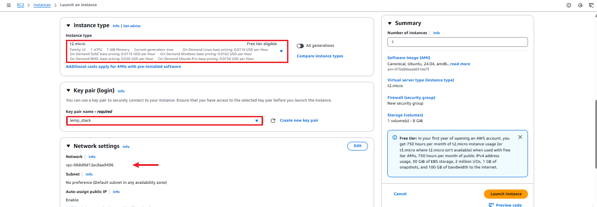
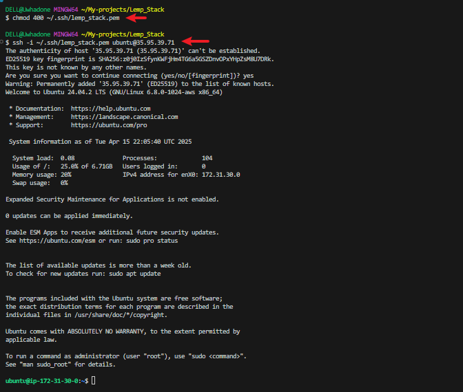
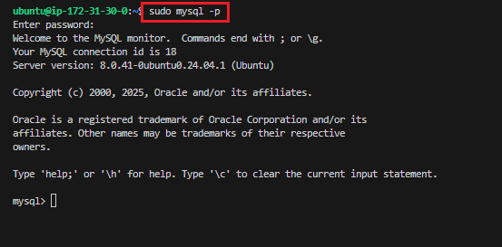
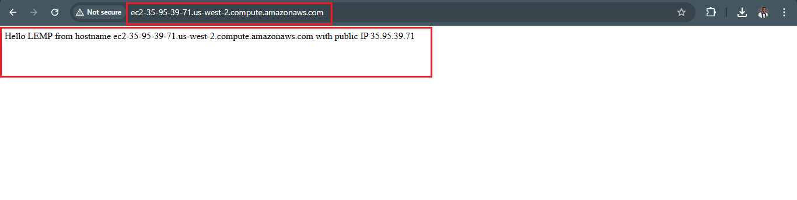

## WEB STACK IMPLEMENTATION (LEMP STACK) IN AWS

### Introduction:

The LEMP Stack is a popular open-source web development platform that consists of four main components: Linux, (E)Nginx, MySQL, and PHP (or sometimes Perl or Python). This documentation outlines the setup, configuration, and usage of the LEMP stack.

A LEMP Stack application is an application which as opposed to a LAMP Stack Application makes use of Nginx as the web server for hosting the web application. NGINX is an open source software for web serving, reverse proxying, caching, load balancing, media streaming, and more.


## Step 0: Prerequisites

__1.__ Launched an Ubuntu EC2 Instance named “Lemp_Stack_Server” with AMI of 24.04 LTS (HVM) in the us-west-2 region using the AWS console.


__2.__ Gave it the instance type of t2.micro which is within the free-tier. Created SSH key pair named __lemp_stack__ to access the instance on port 22.  The default VPC and Subnet were used for the networking configuration.




__3.__ The security group was configured with the following inbound rules:

- Allow traffic on port 22 (SSH) with source from any IP address. This is opened by default.
- Allow traffic on port 443 (HTTPS) with source from anywhere on the internet.
- Allow traffic on port 80 (HTTP) with source from anywhere on the internet.
 And will leave the storage at default; 8gb gp3 volume storage. Then we hit the launch instance button.


__4.__ First, we need to move the keypair file from the download folder into the .ssh folder; 
 cp ~/Downloads/lemp_stack.pem ~/.ssh/

The private ssh key that got downloaded has now been moved, permission was changed for the private key file and then used to connect to the instance by running the following commands;

```
chmod 400 ~/.ssh/lemp_stack.pem
```

```
ssh -i ~/.ssh/lemp_stack.pem ubuntu@35.95.39.71
```
Where __username=ubuntu__ and __public ip address=35.95.39.71__




## Step 1 - Install nginx web server

__1.__ __Update and upgrade the server’s package index__

Run a sudo apt update to download package information from all configured sources.
```
sudo apt update
```


Run a sudo apt upgrade to upgrade the package
```
`sudo apt upgrade -y
``


__2.__ __Install nginx__

Run a sudo apt install nginx -y to install nginx 

```
sudo apt install nginx -y
```


__3.__ __Spin up Nginx and verify that nginx is active and running__

Spin up the nginx server and ensure it automatically starts on system reboot by running the following commands

```
sudo systemctl start nginx
sudo systemctl enable nginx
```
And 

```
sudo systemctl status nginx
```

If it's green and running, then nginx is correctly installed


__4.__ __Access nginx locally on the Ubuntu shell__

Accessing the default nginx web server block to see if everything works correctly. curl the local IP address of our local machine which in most case is 127.0.0.1 or the DNS name localhost on any web browser on our local machine:
```
curl http://127.0.0.1:80
curl http://localhost:80
```


The below result shows nginx has been properly set up and we can deploy our web application.


__5.__ __Test with the public IP address if the Nginx server can respond to request from the internet using the url on a browser.__

```
http://35.95.39.71:80

```


This shows that the web server is correctly installed and it is accessible through the firewall.


__6.__ __Another way to retrieve the public ip address rather than check the aws console__
```
TOKEN=$(curl -X PUT "http://169.254.169.254/latest/api/token" -H "X-aws-ec2-metadata-token-ttl-seconds: 21600")
curl -H "X-aws-ec2-metadata-token: $TOKEN" -s http://169.254.169.254/latest/meta-data/public-ipv4

```


Or enable IMDSv1 in your instance settings:
Go to EC2 Console → Instances → Select your instance.
Actions → Instance Settings → Modify Metadata Options.
Set Metadata version to V1 and V2.
Change the __IMDSv2__ from __Required__ to __Optional__.

The command was run,and the public IP address was displayed. Thing is AWS now defaults to IMDSv2 (Instance Metadata Service Version 2), which requires token.

```


## Step 2 - Install MySQL

__1.__ __Install a relational database (RDB)__

We have succeeded in setting up our nginx webserver and ensured its accessible over the internet. Next is to install mySQL which is a relational database management server to help store data and manage content on our web application.
```
sudo apt install mysql-server
```


__2.__ __Log in to mysql console__
```
sudo mysql
```
This connects to the MySQL server as the administrative database user __root__ inferred by the use of __sudo__ when running the command.


__3.__ __Set a password for root user using mysql_native_password as default authentication method.__

Here, the user's password was defined as "Admin007$"

```
ALTER USER 'root'@'localhost' IDENTIFIED WITH mysql_native_password BY 'Admin007$';
```


Exit the MySQL shell
```
exit
```

__4.__ __Run an Interactive script to secure MySQL__

The security script comes pre-installed with mysql. This script removes some insecure settings and locks down access to the database system.
```
sudo mysql_secure_installation
```


__5.__ __After changing root user password, log in to MySQL console.__

A command prompt for password was noticed after running the command below.
```
sudo mysql -p
```


Exit MySQL shell
```
exit
```

## Step 3 - Install PHP

__1.__ __Install php__

Install php-fpm (PHP fastCGI process manager) and tell Nginx to pass PHP requests to this software for processing. Also, install php-mysql, a php module that allows PHP to communicate with MySQL-based databases. Core PHP packages will automatically be installed as dependencies.

We use php to dynamically display content of our webpage to users who make requests to the web server.
php-fpm : which stands for PHP FastCGI Process Manager is a web tool used for speeding up the performance of a website by handling tremendous amounts of load simultaneously.


The following were installed:
- php-fpm (PHP fastCGI process manager)
- php-mysql

```
sudo apt install php-fpm php-mysql -y
```


## Step 4 - Configure nginx to use PHP processor

__1.__ __Create a root web directory for your_domain__

To serve our web content on our web server, we create a directory for our project inside the /var/www/ directory.
sudo mkdir /var/www/projectlemp Then we change permissions of the projectlemp directory to the current user system
sudo chown -R $USER:$USER /var/www/projectlemp


```
sudo mkdir /var/www/projectlemp
```
__2.__ __Assign the directory ownership with $USER which will reference the current system user__

```
sudo chown -R $USER:$USER /var/www/projectlemp
```


__3.__ __Create a new configuration file in Nginx’s “sites-available” directory__.

```
sudo nano /etc/nginx/sites-available/projectlemp
```
Paste in the following bare-bones configuration:

```
server {
  listen 80;
  server_name projectlemp www.projectlemp;
  root /var/www/projectlemp;

  index index.html index.htm index.php;

  location / {
    try_files $uri $uri/ =404;
  }

  location ~ \.php$ {
    include snippets/fastcgi-php.conf;
    fastcgi_pass unix:/var/run/php/php8.3-fpm.sock;
  }

  location ~ /\.ht {
    deny all;
  }
}
```


### Here’s what each directives and location blocks does:

- __listen__ - Defines what port nginx listens on. In this case it will listen on port 80, the default port for HTTP.

- __root__ - Defines the document root where the files served by this website are stored.

- __index__ - Defines in which order Nginx will prioritize the index files for this website. It is a common practice to list index.html files with a higher precedence than index.php files to allow for quickly setting up a maintenance landing page for PHP applications. You can adjust these settings to better suit your application needs.

- __server_name__ - Defines which domain name and/or IP addresses the server block should respond for. Point this directive to your domain name or public IP address.

- __location /__ - The first location block includes the try_files directive, which checks for the existence of files or directories matching a URI request. If Nginx cannot find the appropriate result, it will return a 404 error.

- __location ~ \.php$__ - This location handles the actual PHP processing by pointing Nginx to the fastcgi-php.conf configuration file and the php7.4-fpm.sock file, which declares what socket is associated with php-fpm.

- __location ~ /\.ht__ - The last location block deals with .htaccess files, which Nginx does not process. By adding the deny all directive, if any .htaccess files happen to find their way into the document root, they will not be served to visitors.

__4.__ __Activate the configuration by linking to the config file from Nginx’s sites-enabled directory__

```
sudo ln -s /etc/nginx/sites-available/projectlemp /etc/nginx/sites-enabled/
```

This will tell Nginx to use this configuration when next it is reloaded.

__5.__ __Test the configuration for syntax error__

```
sudo nginx -t
```


__6.__ __Disable the default Nginx host that currently configured to listen on port 80__

Currently our new server block has been created and configured but the default server block is the default block that comes with nginx install. To unlink it we run the command: sudo unlink /etc/sites-available/default.
We then reload nginx for all configurations to take effect sudo reload nginx.
Create an index.html file inside projectlemp directory and write in contents to be accessed over the internet. Paste public IP address on a browser to see content.

```
sudo unlink /etc/nginx/sites-enabled/default
```

__7.__ __Reload Nginx to apply the changes__
```
sudo systemctl reload nginx
```


__8.__ __The new website is now active but the web root /var/www/projectlemp is still empty. Create an index.html file in this location so to test the virtual host work as expected.__

```
sudo echo ‘Hello LEMP from hostname’ $(curl -s http://169.254.169.254/latest/meta-data/public-hostname) ‘with public IP’ $(curl -s http://169.254.169.254/latest/meta-data/public-ipv4) > /var/www/projectlemp/index.html
```
Or

```
sudo bash -c "echo 'Hello LEMP from hostname $PUBLIC_HOSTNAME with public IP $PUBLIC_IP' > /var/www/projectlemp/index.html"

TOKEN=$(curl -X PUT "http://169.254.169.254/latest/api/token" \
  -H "X-aws-ec2-metadata-token-ttl-seconds: 21600")

PUBLIC_HOSTNAME=$(curl -H "X-aws-ec2-metadata-token: $TOKEN" -s http://169.254.169.254/latest/meta-data/public-hostname)
PUBLIC_IP=$(curl -H "X-aws-ec2-metadata-token: $TOKEN" -s http://169.254.169.254/latest/meta-data/public-ipv4)
```


#### Open the website on a browser using IP address
```
http://35.95.39.71:80
```


#### Open it with public dns name (port is optional)
```
http://<public-DNS-name>:80
```



This file can be left in place as a temporary landing page for the application until an index.php file is set up to replace it. Once this is done, remove or rename the index.html file from the document root as it will take precedence over index.php file by default.

The LEMP stack is now fully configured.
At this point, the LEMP stack is completely installed and fully operational.


## Step 5 - Test PHP with Nginx

Test the LEMP stack to validate that Nginx can handle the .php files off to the PHP processor.

__1.__ __Create a test PHP file in the document root. Open a new file called info.php within the document root.__

Create an info.php file inside the /var/www/projectlemp directory.

```
sudo nano /var/www/projectlemp/info.php
```
Paste in the command below;:
```
<?php
phpinfo();
```
__2.__ __Access the page on the browser and attach /info.php__
```
http://18.209.18.61/info.php
```


After checking the relevant information about the server through this page, It’s best to remove the file created as it contains sensitive information about the PHP environment and the ubuntu server. It can always be recreated if the information is needed later.
```
sudo rm /var/www/projectlemp/info.php
```

## Step 6 - Retrieve Data from MySQL database with PHP

### Create a new user with the mysql_native_password authentication method in order to be able to connect to MySQL database from PHP.

Create a database named todo_database and a user named todo_user

__1.__ __First, connect to the MySQL console using the root account.__
```
sudo mysql -p
```

__2.__ __Create a new database__
```
CREATE DATABASE todo_database;
```


__3.__ __Create a new user and grant the user full privileges on the new database.__
```
CREATE USER 'todo_user'@'%' IDENTIFIED WITH mysql_native_password BY 'Admin123$';

GRANT ALL ON todo_database.* TO 'todo_user'@'%';
```

```
exit
```
__4.__ __Login to MySQL console with the user custom credentials and confirm that you have access to todo_database.__

```
mysql -u todo_user -p

SHOW DATABASES;
```


The -p flag will prompt for password used when creating the example_user

__5.__ __Create a test table named todo_list__.

From MySQL console, run the following:
```
CREATE TABLE todo_database.todo_list (
  item_id INT AUTO_INCREMENT,
  content VARCHAR(255),
  PRIMARY KEY(item_id)
);
```
__6.__ __Insert a few rows of content to the test table__.
```
INSERT INTO todo_database.todo_list (content) VALUES ("My first important item");

INSERT INTO todo_database.todo_list (content) VALUES ("My second important item");

INSERT INTO todo_database.todo_list (content) VALUES ("My third important item");

INSERT INTO todo_database.todo_list (content) VALUES ("and this one more thing");
```


__7.__ __To confirm that the data was successfully saved to the table run:__
```
SELECT * FROM todo_database.todo_list;
```

```
exit
```

### Create a PHP script that will connect to MySQL and query the content.

__1.__ __Create a new PHP file in the custom web root directory__
```
sudo nano /var/www/projectlemp/todo_list.php
```
The PHP script connects to MySQL database and queries for the content of the todo_list table, displays the results in a list. If there’s a problem with the database connection, it will throw an exception.

Copy the content below into the todo_list.php script.
```
<?php
$user = "todo_user";
$password = "Admin123$";
$database = "todo_database";
$table = "todo_list";

try {
  $db = new PDO("mysql:host=localhost;dbname=$database", $user, $password);
  echo "<h2>TODO</h2><ol>";
  foreach($db->query("SELECT content FROM $table") as $row) {
    echo "<li>" . $row['content'] . "</li>";
  }
  echo "</ol>";
} catch (PDOException $e) {
    print "Error!: " . $e->getMessage() . "<br/>";
    die();
}
?>
```


__2.__ __Now access this page on the browser by using the domain name or public IP address followed by /todo_list.php__

```
http://35.95.39.71/todo_list.php
```


__Access this page on the browser by using the domain name followed by /todo_list.php__


### Troubleshoot

One of the major error i faced when implementing this project was after i adjusted my php file and wanted to view my ip address with the path /info.php. I got a 502 error, after much troubleshooting and back and forth, realized where the issue was from. I didnt take note of the php version that was installed, hence i didnt reference the exact version in my populating this file ‘/etc/nginx/sites-available/projectlemp’ so i kept getting502 error until i corrected this line ‘fastcgi_pass unix:/var/run/php/php8.3-fpm.sock;’

### Conclusion

The LEMP stack provides a robust platform for hosting and serving web applications. By leveraging the power of Linux, Nginx, MySQL (or MariaDB), and PHP, developers can deploy scalable and reliable web solutions.


